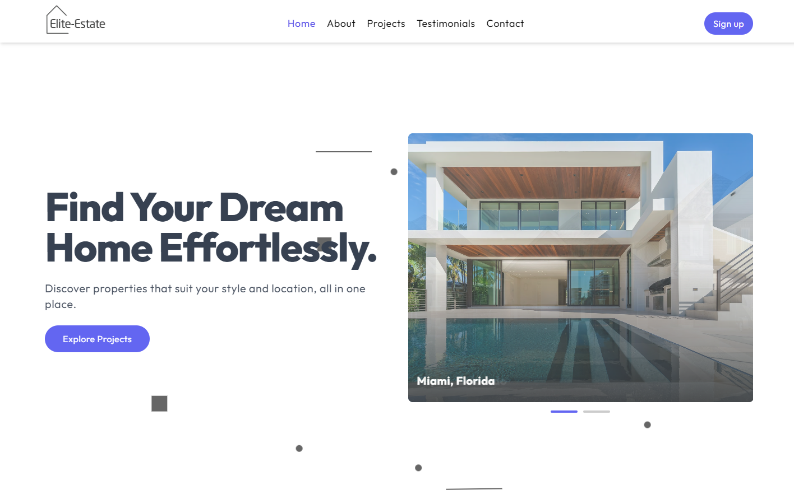

# 🏡 EliteEstate

EliteEstate is a fully responsive, modern single-page landing page built with 🔄 React for a real estate agency. The application provides a seamless user experience with stunning visuals, animations, and a functional 📩 contact form.

---

## ✨ Features

- **Responsive Design**: Fully optimized for all 📱 devices, including 🖥 desktops, 📚 tablets, and 📲 mobile phones.
- **Dynamic Sections**:
  - 🌟 Hero Section: Eye-catching introductory hero section with custom geomatrical background animation and slider.
  - 📄 About Section: Overview of the agency’s mission and values.
  - 🏡 Projects Section: Showcase of real estate projects with slider functionality.
  - 😍 Testimonials Section: Customer reviews presented in an engaging cards.
  - 📩 Contact Section: Functional contact form with Web3Forms.
  - 📝 Footer: Essential links and agency details.
- **Smooth Animations**: Enhanced user experience with section transitions with Framer Motion.
- **Interactive Sliders**: 🎮 Slick sliders to display projects and also used in Hero section.
- **Notifications**: 🎤 Real-time feedback for user interactions via React-Hot-Toast.

---

## ⚙️ Technologies Used

### Frontend
- **🔄 React**: Core library for building the landing page.
- **🎮 React-Slick**: Used for implementing smooth and responsive sliders.
- **🌈 Framer Motion**: For animations and dynamic transitions between sections.
- **🎤 React-Hot-Toast**: For showing notifications (e.g., form submission success/failure).

### Backend/Integrations
- **Web3Forms**: Handles the 📩 contact form submissions without requiring a custom backend.

### Styling
- **👗 TailwindCSS**: For Styling

---

## 🔧 Installation

1. **🔎 Clone the repository**:
   ```bash
   git clone https://github.com/yourusername/eliteestate.git
   ```

2. **🔄 Navigate to the project folder**:
   ```bash
   cd eliteestate
   ```

3. **🔧 Install dependencies**:
   ```bash
   npm install motion react-hot-toast react-router-dom react-slick slick-carousel
   ```

4. **⚡ Run the development server**:
   ```bash
   npm run dev
   ```

   The app will be available at `http://localhost:3000` or may be on another port.

---

## 🔌 Project Structure

```
EliteEstate/
├── public/            # 📲 Public assets
├── src/
│   ├── assets/
│   ├── components/    # 💡 Reusable components (Header, Hero, About, Projects, Video, Heading,   Testimonials, Contact, Footer,)
│   ├── App.jsx         # 🌐 Main application file
│   └── main.jsx       # 🔠 Entry point
├── package.json       # 📦 Project dependencies and scripts
├── vite.config.js     # 📦 Vite configuration file
└── README.md          # 📖 Project documentation
```
---

### 📩 Contact Form
The contact form uses Web3Forms for submission. To set it up:
1. ✉️ Sign up at [Web3Forms](https://web3forms.com/).
2. 🔐 Obtain your Web3Forms access key.
3. Replace the placeholder access key in the contact form component

---

## 📦 Deployment

1. **⚙️ Build the app**:
   ```bash
   npm run build
   ```

2. **🛠 Deploy to a hosting service**:
   - Use services like Vercel, Netlify, or AWS S3.
   - Upload the `dist/` folder to your hosting platform.

---

## 🎮 Acknowledgments

- [React-Slick](https://react-slick.neostack.com/) for creating amazing sliders.
- [Framer Motion](https://www.framer.com/motion/) for animation libraries.
- [React-Hot-Toast](https://react-hot-toast.com/) for notifications.
- [Web3Forms](https://web3forms.com/) for handling contact form submissions.

---

## 🔒 License

This project is licensed under the [MIT License](LICENSE).

---

## 🖼️ Screenshots



---

## 📢 Contact

For inquiries, please contact:
- **📧 Email**: codebyfaisal@gmail.com
- **🌐 Website**: [eliteestate-agency.netlify.app](eliteestate-agency.netlify.app)